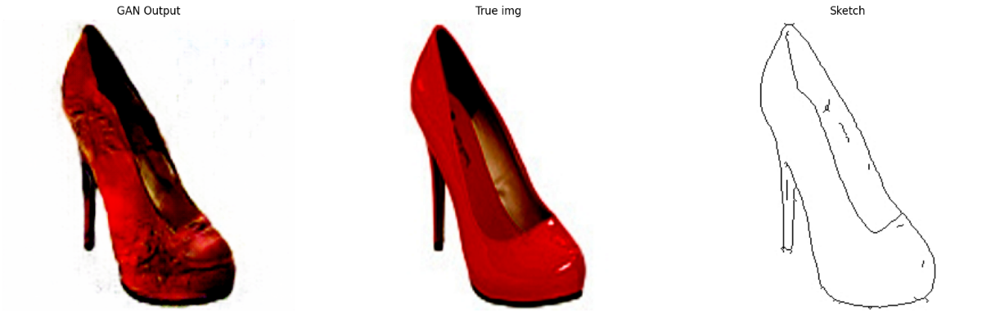

# Adi-GAN-s

*Your faithful shoe designer*

Adi-GAN-s is a project that uses the edges2shoes dataset to transform shoe sketches into detailed designs using Generative Adversarial Networks (GANs).

## Introduction

Adi-GAN-s leverages the power of GANs to create realistic shoe designs from simple sketches. This project is based on the pix2pix framework and utilizes the edges2shoes dataset for training and evaluation.

## Tech Stack

## Results

Here are some example results generated by Adi-GAN-s:

  
Example 1

  

  
Example 2

  

  
Example 3

  

  
Example 4

  

  
Example 5

  

  
Example 6

  

## Acknowledgements
- [Image-to-Image Translation with Conditional Adversarial Networks](https://arxiv.org/abs/1611.07004)
- [Aladdin Persson](https://www.youtube.com/playlist?list=PLhhyoLH6IjfwIp8bZnzX8QR30TRcHO8Va)

